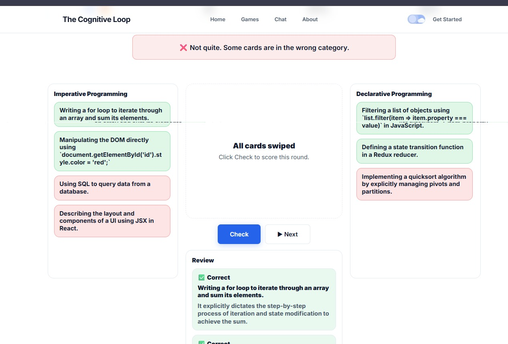
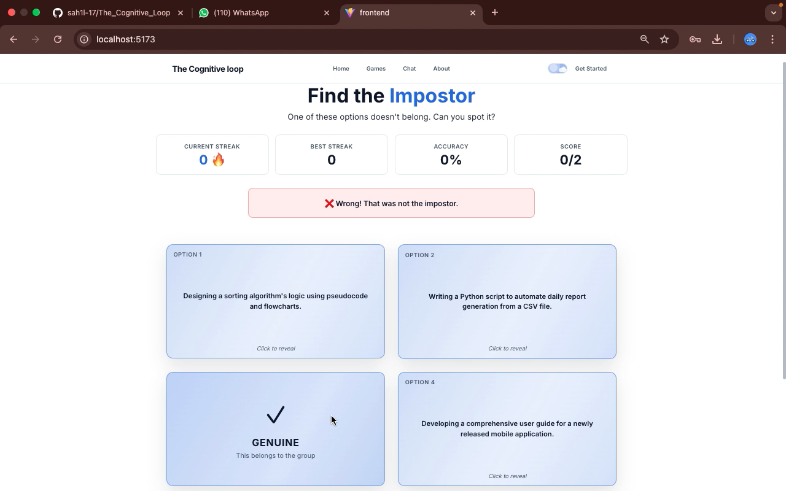

# 🧠 The Cognitive Loop

**The Cognitive Loop** is an autonomous AI-powered tutor designed to revolutionize learning through multimodal content ingestion and adaptive pedagogical strategies. By combining advanced Large Language Models with active recall gaming mechanics, it creates a personalized feedback loop that ensures deep conceptual understanding.



## 🚀 Features

- **Multimodal Ingestion**: Seamlessly process PDFs, images, and raw text to build a structured knowledge base.
- **Adaptive Tutor Agent**: An AI tutor that detects confusion levels and adjusts explanation styles (Socratic, Analogical, or Direct) based on your understanding.
- **Active Recall Games**: Automatically generated practice exercises including:
  - **Swipe Sort**: Binary classification for rapid conceptual boundary testing.
  - **Impostor**: Identifying subtle outliers to test nuanced understanding.
  - **Match Pairs**: Building relational associations between complex concepts.
- **Orchestration Layer**: Intelligent routing that handles various interaction types (chat, ingestion, practice) in a unified session.



## 🛠️ Architecture

The project is built with a decoupled Full-Stack architecture:

- **Backend**: FastAPI (Python)
  - **Agents**: Specialized agents for Orchestration, Ingestion, Tutoring, and Game Generation.
  - **Core**: State management, routing, and schema definitions.
  - **Services**: File processing, LLM integration (Gemini), and session persistence.
- **Frontend**: React + Vite
  - **UI**: Modern interface built with Tailwind CSS and Framer Motion for smooth game transitions.
  - **State**: Centralized session management for real-time tutor feedback.

## 🏁 Getting Started

### Prerequisites

- Python 3.10+
- Node.js 18+
- Gemini API Key

### Backend Setup

1. Navigate to the backend directory:
   ```bash
   cd backend
   ```
2. Install dependencies:
   ```bash
   pip install -r requirements.txt
   ```
3. Set up environment variables in a `.env` file:
   ```env
   GEMINI_API_KEY=your_key_here
   SESSION_STORAGE_TYPE=memory # or mongo
   ```
4. Run the server:
   ```bash
   python run_server.py
   ```

### Frontend Setup

1. Navigate to the frontend directory:
   ```bash
   cd frontend
   ```
2. Install dependencies:
   ```bash
   npm install
   ```
3. Start the development server:
   ```bash
   npm run dev
   ```


## 📖 License

This project is licensed under the MIT License.